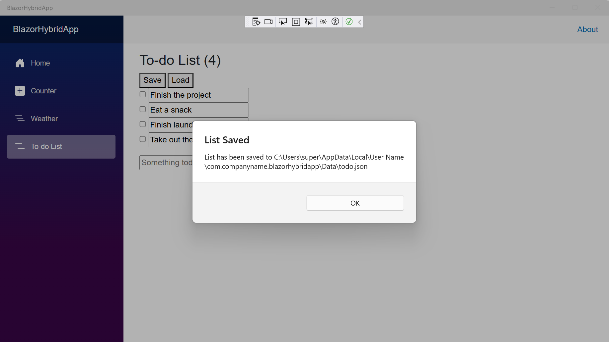

#  Build a mobile and desktop app with Blazor Hybrid and .NET MAUI
[1. Introduction](https://learn.microsoft.com/en-us/training/modules/build-blazor-hybrid/1-introduction)  
[2. What is Blazor Hybrid?](https://learn.microsoft.com/en-us/training/modules/build-blazor-hybrid/2-understand-blazor-hybrid)  
[3. Exercise - Create and run a Blazor Hybrid app](https://learn.microsoft.com/en-us/training/modules/build-blazor-hybrid/3-exercise-configure-environment?pivots=vstudio)  
[4. Razor components in Blazor Hybrid](https://learn.microsoft.com/en-us/training/modules/build-blazor-hybrid/4-blazor-components)  
[5. Exercise - Add a component](https://learn.microsoft.com/en-us/training/modules/build-blazor-hybrid/5-exercise-add-component?pivots=vstudio)  
[6. Data binding and events in Blazor Hybrid](https://learn.microsoft.com/en-us/training/modules/build-blazor-hybrid/6-csharp-razor-binding)  
[7. Exercise - Data binding and events](https://learn.microsoft.com/en-us/training/modules/build-blazor-hybrid/7-exercise-razor-binding?pivots=vstudio)  
[8. Access platform features in Blazor Hybrid](https://learn.microsoft.com/en-us/training/modules/build-blazor-hybrid/8-platform-features)  
[9. Exercise - Access platform features in Blazor Hybrid](https://learn.microsoft.com/en-us/training/modules/build-blazor-hybrid/9-exercise-platform-features)  

# Saving and loading data to disk  
.NET includes the System.IO namespace that includes the ability to load and save files to disk.  
.NET MAUI maps this functionality to native APIs for you automatically;  all you need to do is specify where to save the file.  
Each platform has special locations to save user data.   
The file system helpers in .NET MAUI provide access to get multiple platform directories including the cache and app data directories.  
It also can load files that are bundled directly into the app.

# To-do List functionality  
-Add items  
-Edit items  
-Mark items done  
-Select the Save button to save items to the disk  
-Then, close and restart the app or make changes and select Load to load the saved data. 
   
  

# Some things to explore further: 
   
- How can I get the to-do items to load automatically when the page loads? (similar to OnAppearing event handling in MAUI)